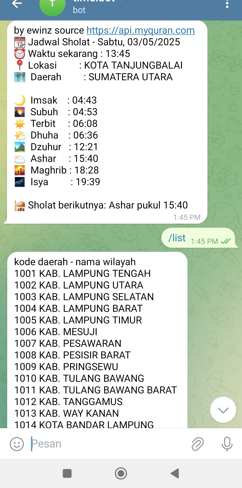
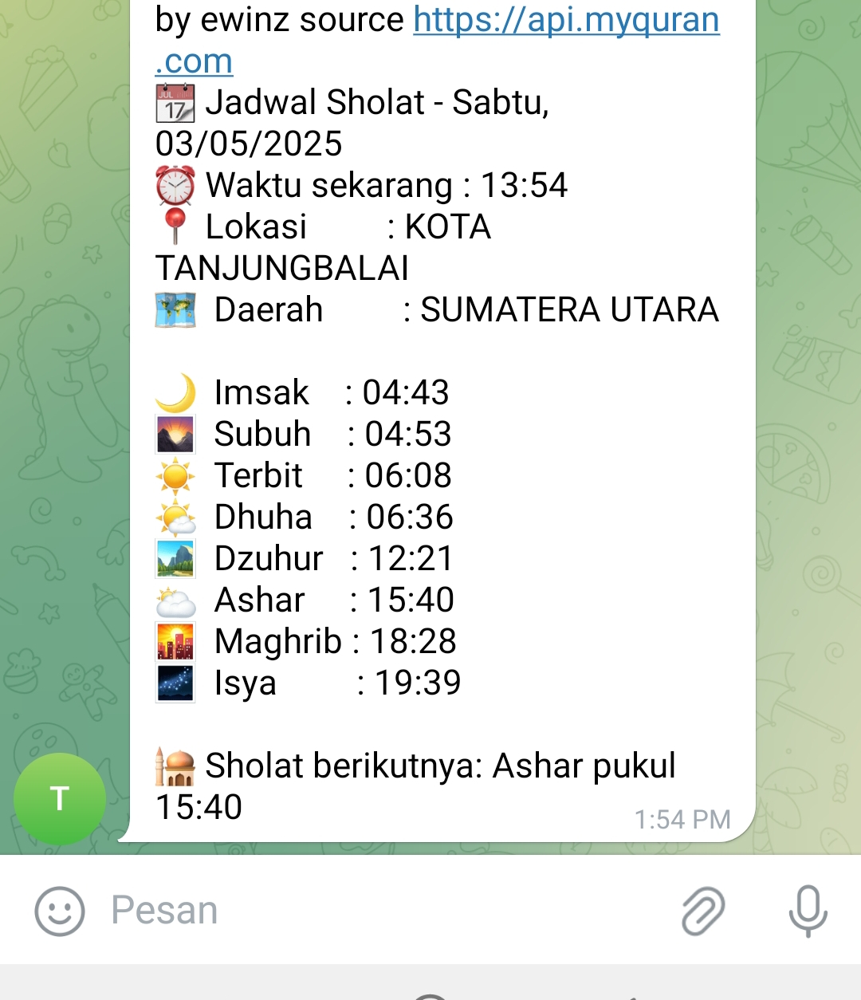

 -----BOT TELEGRAM WAKTU SHOLAT INDONESIA-------

 #############source https://api.myquran.com #######

<h2>Screenshot</h2>

<h3>Tampilan</h3>

##Cara INSTALL##

#install server pengingat waktu telegram INDONESIA 
#silakan copas

mv adzan-time-telegram/sholat $HOME/

bash sholat/install.sh.wal

#token_bot telegram

nano sholat/.config/.id

#id supergrup

nano sholat/.config/.tok

systemctl start sholat-bot

#masukan id kota cek chat private bot

nano sholat/ID_KOTA.txt

systemctl start sholat-sebelum

systemctl start sholat-tiba

systemctl status sholat-bot sholat-sebelum sholat-tiba

<h3>Tampilan Kedua</h3>

##saran kalau untuk kirim ke whatsapp grup bisa gunakan Green-api
